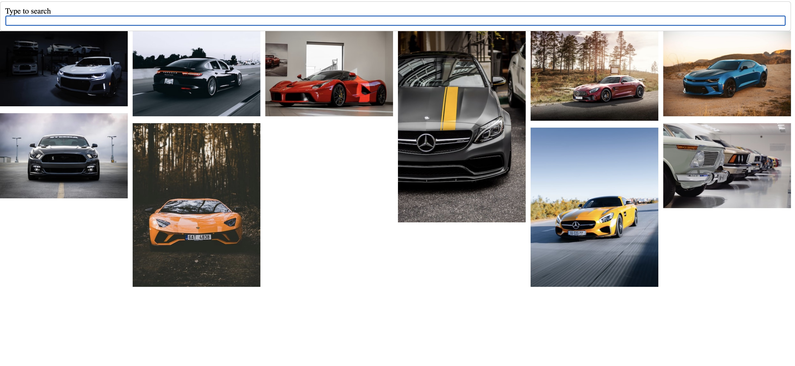

# React_Image_Search

Repository created following this [Udemy Course](https://www.udemy.com/course/react-redux/) to practice the following basic React concepts:

- Child to Parent Communication
- API requests
- Form basic handling

## Application

Application has an input to type a term. Once the end user hits enter, there is an api request to unsplash and it will retrieve 10 images related to the used term in the input.



## Run Locally

Prerequisites
The application uses unsplash as a source to get the images. If you want to execute the app, you need to

- Navigate to: [Unsplash](https://unsplash.com/developers) and register yourself to get an account.
- Click in 'Your Apps' and create a new one accepting all the conditions.
- Use the Access key that you will obtain when creating the app, and place it in Api.js file ( line 6 )

Clone the project

```bash
  git clone https://github.com/pedrolopezbiedma/React_Image_Search.git
```

Install dependencies

```bash
  npm install
```

Start the application

```bash
  npm run start
```

## Authors

- [@pedrolopezbiedma](https://github.com/pedrolopezbiedma)
